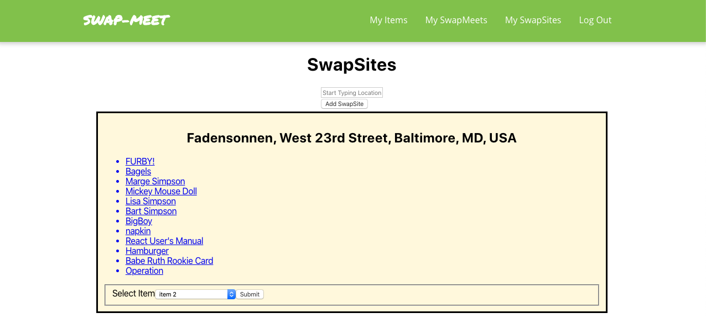

## Swap-Meet

A MERN web application for local non-currency bartering.

### Overview

Swap-Meet is a MERN web application that allows registered users to create an inventory of swappable items, add and peruse swap sites in their area and offer to swap items with other users at given swap sites. Making an offer to swap an item with another user creates a Swap-Meet offer that sets a date, time and locale for meeting up and potentially swapping items.

### Technologies Used

Swap-Meet works with four different data objects on a MongoDB server - users, items, sites, and meets - to keep track of user to user interactions for in-person item swaps at given sites. The UI is a ReactJS front end that allows an end-user to add items to their inventory and swapsites where they would be willing to have swap meets with other users. The SwapSite creation page consumes Google Places API to offer swap site geolocation suggestions to ensure that all swap sites can be viewed on google maps in a later version of the application.

### Getting Started

To get started navigate to the deployed app at the link below. From there create a user and you should be able to intuitively start adding inventory items for swapping and perusing existing swap sites where other users are willing to hock their respective inventory items.

https://swap-meet-app.herokuapp.com/

### Unsolved Problems

Although end users can create swap meet offers, viewing a list of existing offers is still not set up on the front-end UI. Image upload for items is stubbed out but not functioning properly.

### Future Enhancements

In the future Swap-Meet will have an interactive Google Map of SwapSites based on the user's current location. Furthermore the swap meet offers with have a greater breadth of interactivity to allow users to change swap meet times, locales and items.

